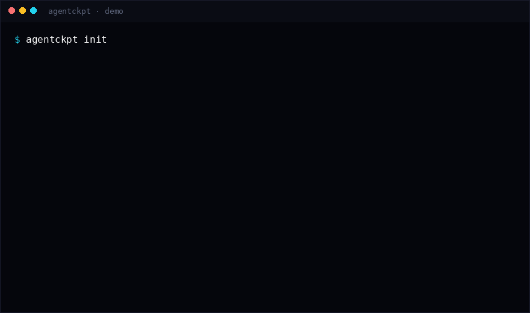

<p align="center"></p>

# agentckpt

**Checkpoint a working tree while coding agents run, and restore any snapshot without touching your git branches or index.**

<p align="center"></p>

Coding agents (Codex, Claude Code, Gemini CLI, OpenCode, Cursor agents, …) edit and delete files. Built-in `/undo` is often missing or unreliable — see [openai/codex#9203](https://github.com/openai/codex/issues/9203) (522👍, still open) and [V2EX](https://www.v2ex.com/t/1218209). agentckpt keeps a private shadow store under `.agentckpt/` so you can snap (including untracked files) and restore freely. It never runs `git add` / `git commit` or moves branches in your real `.git`.

## Install

```bash
uvx --from git+https://github.com/Blackman99/agentckpt agentckpt demo     # run without installing
pipx install git+https://github.com/Blackman99/agentckpt                  # or install the command
```

Zero Python dependencies, Python 3.9+, requires `git` on `PATH`. Wheels are on the [releases page](https://github.com/Blackman99/agentckpt/releases).

## Usage

```bash
agentckpt init
agentckpt snap -m "before agent"
# … agent rewrites the tree …
agentckpt ls
agentckpt restore <id> --force    # overwrite divergent files; omit --force to skip conflicts
```

Auto-snap while an agent works: `agentckpt watch`. Housekeeping: `agentckpt prune --keep 50`, `agentckpt doctor`.

**Docs:** [blackman99.github.io/agentckpt/docs](https://blackman99.github.io/agentckpt/docs/) · MIT
